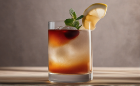

# C5. Visual Recognition - Master in Computer Vision

## Week 5: Difusion Models (I)

⚠️⚠️⚠️ Check our final slides [here](https://docs.google.com/presentation/d/1MlQPRpjzPVIdy00WUVDrs9ibqbTohHMr6xRDkt-_1o4/edit?usp=sharing)!

Welcome to **Week 5** of our project on  **Difustion Models**! Building on last week's image-captioning work we have worked on: 

- **Compare** multiple Stable Diffusion variants (2.1, XL Base, XL Turbo and 3.5 Medium)
- **Calibrate** [XL Base](https://huggingface.co/stabilityai/stable-diffusion-xl-base-1.0) (via Hugging Face) by varying denoising steps, sampler (DDPM vs DDIM), CFG scale and negative prompting.
- **Problem analysis** of the model and dataset. Identifying “drinks” as a minority class and relabeling them both automatically and manually
- **Image generation** of realistic and diverse drinks using Stable Diffusion XL Base.
- **Fine-tuning** the image captioning model with augmented data and **measuring** its behaviour both qualitatively and quantitatively.

We continue to work on the [Food Ingredients and Recipes Dataset with Images](https://www.kaggle.com/datasets/pes12017000148/food-ingredients-and-recipe-dataset-with-images), aiming to generate dish titles from food images.

---

### 🍽️ Examples:
#### Original dataset example


**Desired Caption:** *"Miso-Butter Roast Chicken With Acorn Squash Panzanella"*

#### Augmented drink example


**Caption:** *"Django Reinhardt"*

---

## 📂 Project Structure

```
├── annotate_text_images.py          # Script to overlay and annotate text on images for identifying drinks
├── consts.py                        # Project-wide constants and configuration settings
├── csv_generated_images.py          # Merge the original dataset with the annotated images
├── dataset.py                       # Dataset class for main training and evaluation pipelines
├── drink_classifier.py              # Model and scripts to classify drink vs. non‑drink items with LLMs
├── evaluate_image_captioning_models.py
│   # Evaluate and compare different image‑captioning models with a given dataset
├── evaluator.py                     # Compute evaluation metrics and scoring functions
├── experiments_drink_augmentation.py
│   # Experiments focusing on drink‑specific data augmentation
├── experiments.py                   # General experiment runners and utilities
├── main_experiments.py              # Entry point to launch full experimental suites
├── plots.ipynb                      # Jupyter notebook for result visualization and analysis
├── save_splits_drinks.py            # Script to create and save train/val/test splits for drinks
├── task1.py                         # Last weeks adapted Task 1: Fine‑tuning the ViT‑GPT2 image‑captioning model
├── utils.py                         # Helper functions and common utilities
```

---
## 🏋️‍♂️ Tasks Overview
### 🔧 Task 1: Stable Diffusion Setup & Comparison
Installed SD 2.1, SD XL Base, SD XL Turbo and SD 3.5 Medium; compared their out‑of‑the‑box generation quality. Substitute "xl" for the model to test.

```bash
python main_experiments.py --experiment model_comparison --model "xl"
```

### 🔍 Task 2: Inference Parameter Sweeps
Ran systematic sweeps over the desired aspect to test. Options: cfg_strength, ddim_vs_ddpm, num_denoising_steps, or negative_prompting.
```bash
python main_experiments.py --experiment cfg_strength --model xl
```

### 🔎 Task 3: Model & Dataset Diagnosis
Annotated and detected that drinks (~6 %) were under‑represented and hurt performance. Used a LLM for a quick classifier and re‑labeled the result in order to reduce noise.
```bash
python annotate_text_images.py
python drink_classifier.py
python csv_generated_images.py
```
### 🖼️ Task 4: Synthetic Drink Generation
Used SD XL Base with negative prompting to generate hundreds of realistic drink images. Prompt-engineered to obtain diversity in the angles of the drinks.

```bash
python experiments_drink_augmentation.py
```

### 🔧 Task 5: Captioning Fine‑Tuning & Evaluation
Merged generated drinks into the training set, fine‑tuned ViT‑GPT2, and ran full evaluations—both quantitative (BLEUs, ROUGE-L and METEOR) and qualitative.

```bash
python save_splits_drinks.py
python task1.py
python evaluate_image_captioning_models.py
```

---

## 🖼️ Dataset

We use the same dataset as Week 3 and 4: **Food Ingredients and Recipes Dataset with Images**. Make sure it's downloaded and properly linked.

🔗 **Dataset link:** [Kaggle Dataset](https://www.kaggle.com/datasets/pes12017000148/food-ingredients-and-recipe-dataset-with-images)

---

## 📊 Evaluation & Visualization

- Use `evaluator.py` to compute metrics like BLEU, METEOR and ROUGE.
- Open `plots.ipynb` to explore and visualize training progress and results.

---

## 🚀 Setup Instructions

Make sure all required libraries are installed:

```bash
pip install -r requirements.txt
```

Then you’re ready to run training, evaluation, and testing scripts!

---

## 📌 Notes

- Modify paths and configurations as needed in `consts.py`. Other scripts may also contain paths, make sure to check it!
- We are not using LoRA-based fine-tuning. Training may be slow..

---


## 💡 **Updates**
This repository will be updated weekly throughout the duration of the module.  
Once the module is completed, further updates are unlikely.

## 👥 **Team**
For any questions or debugging help, reach out to the team! 🚀
- [**Arnau Barrera**](https://github.com/arnalytics)  
- [**Alex Ferrando**](https://github.com/AlexFerrando)  
- [**Pol Rosinés**](https://github.com/RosinesP)  
- [**Oriol Marín**](https://github.com/Uriiol1808)  
