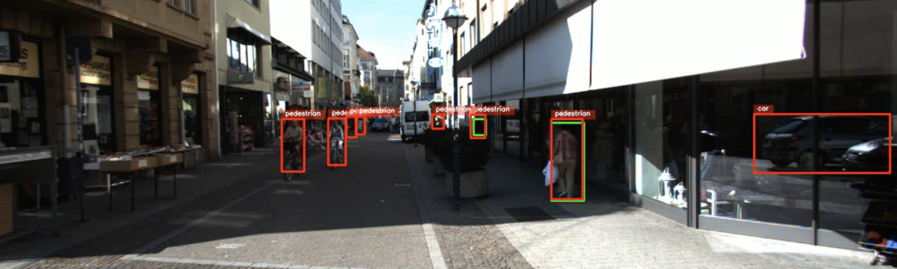
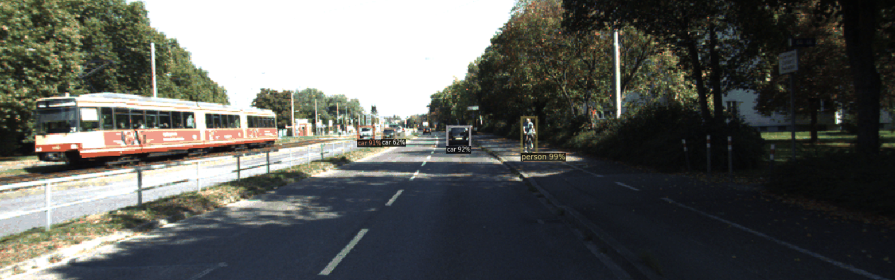
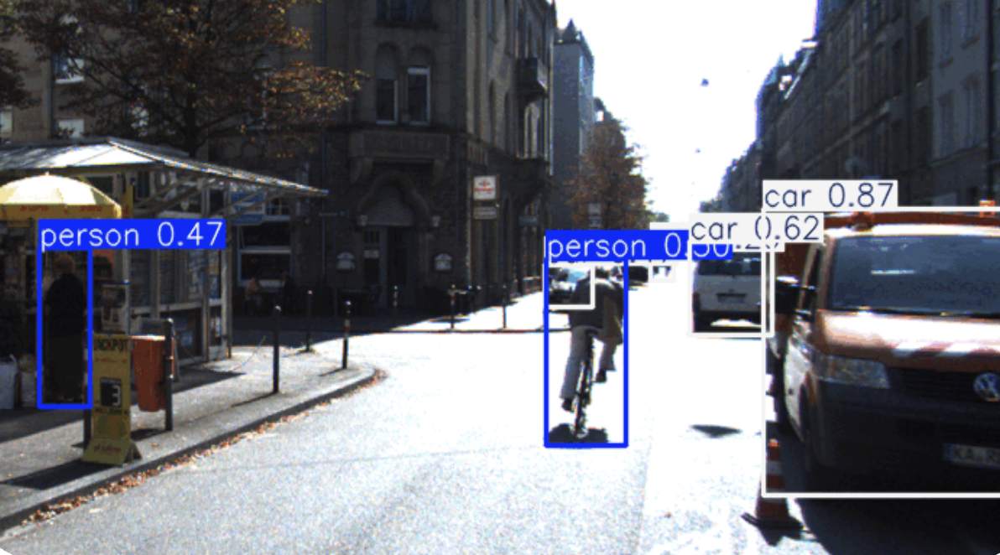
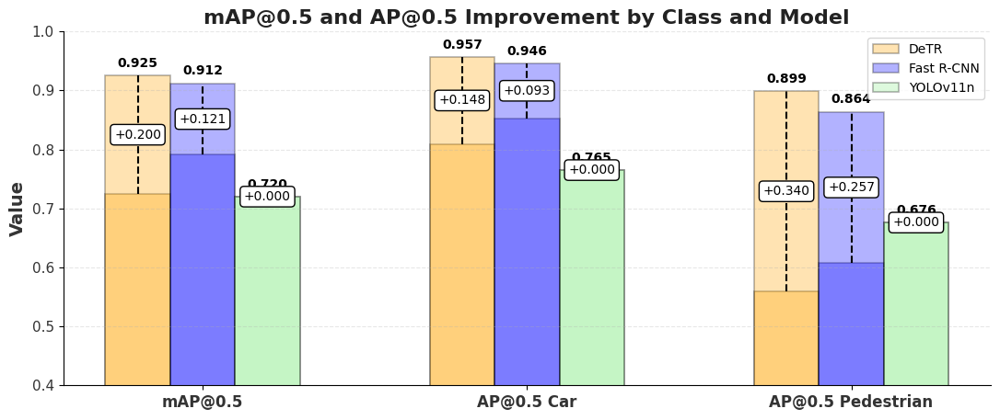

# C5 Project
Team 3 repository of the [C5 - Visual Recognition](https://mcv.uab.cat/c5-visual-recognition/) subject of the Master in Computer Vision at UAB.

*   **Environment Setup:** We used Conda to manage the environment. To replicate our environment, follow these steps:

    1.  **Install Conda:** If you don't already have Conda installed, download and install Miniconda or Anaconda.

    2.  **Create the Environment:**  Navigate to the root directory of this project (where `environment.yml` is located) in your terminal and run:

        ```bash
        conda env create -f environment.yml
        ```

    3.  **Activate the Environment:**  Activate the newly created environment:

        ```bash
        conda activate <env_name>
        ```

    This `environment.yml` file contains all the necessary dependencies.

* The code is organized as follows:
    - Each model code is divided into its own folder [detectron2](/mcv-c5-group-3/detectron2/), [huggingface](/mcv-c5-group-3/huggingface/) and [ultralytics_](/mcv-c5-group-3/ultralytics_/).

## Week 1
Week 1 focused on object detection. The summary slides of our work during this week can be found [here](https://docs.google.com/presentation/d/1RshITh9NvEmbJ8ndc5DF7OZFQ5BvnOvzYS6pJQe3nA0/edit#slide=id.g31bab77bdae_0_0):

This section details our efforts in inference, training, and validation of three prominent deep learning models:

*   **Faster R-CNN**
*   **DeTR**
*   **YOLO**


The following tasks were addressed using the KITTI-MOTS dataset and as domain shift, CPPE-5.


### Task C: Run inference with pre-trained Faster R-CNN, DeTR and YOLO on KITTI-MOTS dataset.

We ran inference using pre-trained Faster R-CNN, DeTR, and YOLO models on the KITTI-MOTS dataset.  This involved setting up the environments for each model, loading the pre-trained weights, and processing the KITTI-MOTS data to generate object detection predictions.
**Implementation Details:**

*   **Environment Setup:** We used as suggested by the teachers Hugging Face for DeTR, Ultralytics for YOLO and Detectron2 for Faster R-CNN.
*   **Model Loading:**  Pre-trained weights were downloaded from the Hugging Face Hub, downloaded from ultralytics of from the already built-in Detetron2 methods, here and in the following tasks.
*   **Inference Execution:**  Inference was performed using scripts located in [`inference.py`](https://github.com/AlexFerrando/mcv-c5-group-3/blob/main/huggingface/inference.py) for DeTR, [`inference.py`](https://github.com/AlexFerrando/mcv-c5-group-3/blob/main/ultralytics_/inference.py) for YOLO11n and [`task_c.py`](https://github.com/AlexFerrando/mcv-c5-group-3/blob/main/detectron2/task_c.py). 

Below we show some example frames of our models running inference in the KITTI-MOTTS dataset:


#### DeTR
<p >
    
</p>

#### Faster R-CNN
<p >
    
</p>

#### YOLO11n
<p >
    
</p>


### Task D: Evaluate pre-trained Faster R-CNN, DeTR and YOLOv(>8) on KITTIMOTS dataset
To evaluate and compare the performance of the different models tested we will us the Average Precision at IoU 0.5 (AP@0.5).

The Intersection over Union (IoU) at threshold 0.5 is computed as IoU = (area of overlap) / (area of union), and a prediction is considered correct if `IoU ≥ 0.5`.

We evaluated the models using the pre-trained or off the shelf Faster R-CNN, DeTR, and YOLO models on the KITTI-MOTS dataset.

To evaluate **DeTR** the steps to follow are:
1. **Run inference**  
   - Execute the [`inference.py`](/mcv-c5-group-3/huggingface/inference.py) script to generate predictions on the KITTI-MOTS dataset using the pre-trained **DeTR** model. This script will output the predicted bounding boxes, segmentation masks, and class labels for each image in the dataset.

2. **Obtain ground truth annotations**  
   - Use [`get_ground_truth.py`](/mcv-c5-group-3/huggingface/get_ground_truth.py) to extract the ground truth labels from the KITTI-MOTS dataset. This ensures that we have the correct bounding boxes and segmentation masks to compare against the model's predictions.

3. **Evaluate the model**  
   - Run [`coco_eval.py`](/mcv-c5-group-3/huggingface/coco_eval.py) to compare the model's predictions with the ground truth annotations using standard COCO evaluation metrics. This script computes the key performance metrics needed to evaluate the model.

To evaluate **Faster R-CNN**, follow this step:

1. **Run `task_d.py`** file:
   - Execute [`task_d.py`](/mcv-c5-group-3/detectron2/task_d.py) to evaluate the **Faster R-CNN** model on the KITTI-MOTS dataset. This script initializes the model, loads the dataset, and computes evaluation metrics such as **AP@0.5** using COCO evaluation metrics.  

Internally, `task_d.py` performs the following:  
- Registers the KITTI-MOTS dataset for evaluation.  
- Loads the pre-trained **Faster R-CNN** model.  
- Uses the **COCOEvaluator** to compute AP and IoU scores.  
- Outputs the evaluation results.  

Finally, to evaluate **YOLO**, follow this step:

1. **Run `evaluation.py`**  
   - Execute [`evaluation.py`](/mcv-c5-group-3/ultralytics_/evaluation.py) to evaluate the **YOLO** model on the KITTI-MOTS dataset.  
   - This script loads the **pre-trained YOLO model**, performs inference on the dataset, and computes key evaluation metrics.  

Internally, `evaluation.py` performs the following:  
- Loads the pre-trained **YOLO** model from the specified path.  
- Runs inference on the **validation** set (`split="val"`) using the **KITTI-MOTS YOLO configuration**.  
- Computes **mAP (Mean Average Precision) at IoU thresholds (AP@0.5, AP@0.75, AP@0.5:0.95)**.  
- Saves evaluation metrics (precision, recall, F1-score) to an output file for analysis.  

### Evaluation Results  

The table below presents the **Mean Average Precision (mAP)** results at different IoU thresholds (**AP@0.5**) for each model:

| Model        | mAP@0.5 | mAP@0.5 (Car) | mAP@0.5 (Pedestrian) |
|-------------|--------------|---------------|---------------------|
| **DeTR**    | 0.725       | 0.809         | 0.559               |
| **Faster R-CNN** | 0.791  | 0.853         | 0.607               |
| **YOLO**    | 0.720       | 0.765         | 0.676               |

**Key Takeaways:**  
- **Faster R-CNN** achieved the highest **overall mAP@0.5** (**0.853**), performing best on the **Car** category.  
- **YOLO** performed better than **DeTR** for detecting **Pedestrians** but had lower mAP for **Cars** compared to **Faster R-CNN**.  
- **DeTR** had the lowest mAP for **Pedestrians** but showed competitive performance for **Cars**.  

---

### Task E: Fine-tune Faster R-CNN, DeTR and YOLO on KITTI-MOTS.

To improve the performance of the models, we fine-tuned them on the **KITTI-MOTS** dataset. The goal was to adapt the models better to the dataset-specific characteristics and enhance detection accuracy.  

Fine-tuning **DeTR**  

For **DeTR**, we fine-tuned the **last layer of the Feed-Forward Network (FFN) in the prediction head**. The best-performing hyperparameters were:  

- **Learning rate**: `5e-5`  
- **Weight decay**: `1e-4`  
- **Learning rate scheduler**: `'cosine'`  
- **Training duration**: `10 epochs`  

For **Fast R-CNN**, we also performed albumentations and fine-tuned to obtain the following best-performing hyperparameters:

- **Images per batch**: `2`  
- **Batch size**: `164`  
- **Max iterations**: `'600'`  

On the other hand, the fine-tuning with **YOLO11n** did not lead to the expected results.  

- **Unexpected degradation in the first iteration** significantly reduced the model's performance compared to the off-the-shelf evaluation.  
- **Reducing the learning rate** helped mitigate this issue but did not fully resolve it.  
- We experimented with different settings and were **surprised to find that YOLO's default augmentations were already highly effective**.  
- **Tweaking the augmentations actually decreased performance**, rather than improving it.  

Upon **visual inspection**, the degradation was not as severe as initially expected.

### Off-the-Shelf vs. Fine-Tuned Performance
<p align="center">
    
</p>
This plot compares the performance of three object detection models—DeTR, Fast R-CNN, and YOLOv11n—on mAP@0.5 and AP@0.5 for different object classes (Cars and Pedestrians). The bars represent the final scores, while the black dashed lines indicate improvements after fine-tuning.

- **DeTR outperforms other models in accuracy and fine-tuning gains**  
  - Achieves the highest scores across all metrics, especially in AP@0.5 for Pedestrians (0.899) and Cars (0.957).  
  - Shows the largest post-fine-tuning improvements, particularly in pedestrian detection (+0.340).  

- **Fast R-CNN performs well but has smaller improvements**  
  - Competitive performance, reaching 0.946 AP@0.5 for Cars.  
  - Fine-tuning provides moderate improvements, with a +0.257 increase for pedestrian detection.  

- **YOLOv11n is stable but underperforms relative to other models**  
  - Consistently records the lowest scores across all metrics (e.g., mAP@0.5: 0.720, AP@0.5 Car: 0.765, AP@0.5 Pedestrian: 0.676).  
  - No noticeable performance gains from fine-tuning, suggesting potential limitations in its architecture or training process.  


### Task F:  Fine-tune either Faster R-CNN and DeTR on Different Dataset
For the fine-tuning in a differnt domain, we have decided to fine-tune DeTR on the dataset CPPE-5: Medical Personal Protective Equipment Dataset. It contains 5 different classes: {Coverall, Face shield, Glove, Mask, Goggles} and 1000 annotated images with corresponding bounding boxes. For the training and validation, we have splitted this dataset randomly following the usual 80%-20% split.

The fine-tuning strategy that we have used is the same as we followed for the fine-tuning with KITTI-MOTS dataset, replacing the last classification layer and adapting it to our dataset: 5 classes + “N/A” class. The hyperparameters used used during the training are presented below:

- **Learning rate**: `1e-5`  
- **Weight decay**: `1e-4`
- **Learning rate scheduler**: `'cosine'`  
- **Training duration**: `75 epochs`  

The number of epochs is significantly higher that in the KITTI-MOTS fine-tuning because of the increased complexity of the dataset (4 more classes) and also the reduces number of training samples. 

The final detection results are presented in the plot below:

<p align="center">
    
</p>

Increasing even further the number of training epochs probably would have imporoved the detection results, but given the short amount of time we couldn't test it.


## Team 5
- Alex Ferrando ([email](mailto:alexferrando15@gmail.com)) 
- Pol Rosinés ([email](mailto:polrosines@gmail.com))
- Arnau Barrera ([email](mailto:arnau6baroy@gmail.com))
- Oriol Marín ([email](mailto:oriolmarin18@gmail.com))
